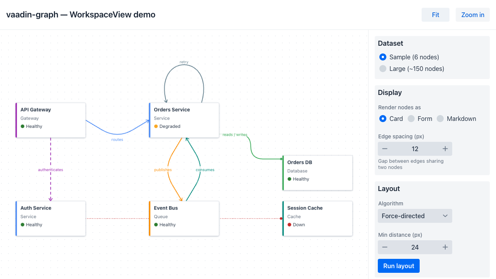
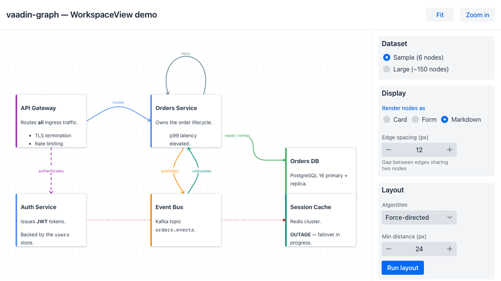
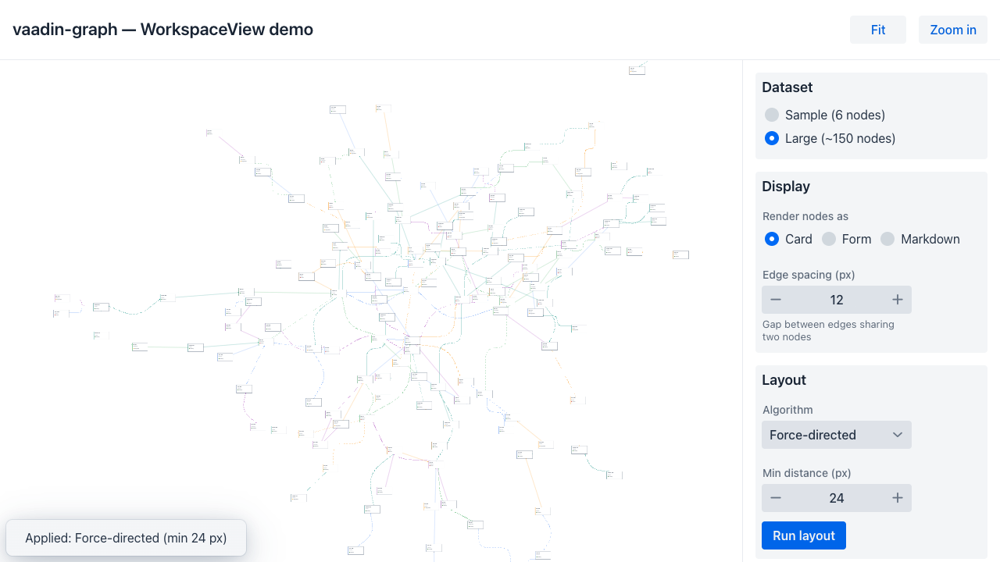
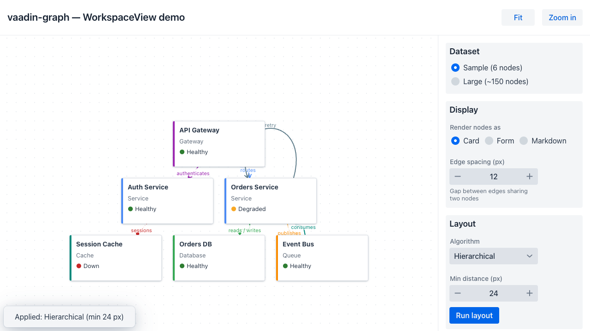

# vaadin-graph

`WorkspaceView<T>` — a zoomable, pannable, **data-driven** Vaadin graph workspace. Like `Grid<T>`,
it is driven by a `DataProvider<T,?>` plus two functions:

- `describe(T)` → a `WorkspaceDescriptor` giving the node's position, size, and outgoing edges,
- `render(T)` → any Vaadin `Component` for the node's visuals.

Nodes are real Vaadin components (cards, forms, even live Markdown). Edges are drawn client-side as
SVG with boundary clipping, four routing modes, solid/dashed/dotted strokes, arrowheads, labels,
self-loops, and properly-separated multi-edges — over a configurable canvas grid. Five pluggable
layout algorithms can re-arrange the graph.



## Features

- **Data-driven** — `DataProvider` + `describe`/`render`; diffs items on refresh, reuses node
  components, resolves edge targets to ids server-side.
- **Edge routing** — `STRAIGHT`, `ORTHOGONAL` (sharp 3-segment elbow), `CURVED` (a 2-segment line
  with one rounded bend), `ROUNDED` (the elbow with rounded corners).
- **Edge styling** — per-edge color, stroke width, `SOLID`/`DASHED`/`DOTTED`, four arrowhead types
  (none/arrow/circle/diamond) at either end, and optional labels.
- **Multi-edges** — edges sharing a node pair run in their own lanes (clipped on the *offset* line so
  they attach to distinct boundary points) with an adjustable gap.
- **Self-loops** — an edge to the same node arcs above it.
- **Interaction** — wheel/pinch zoom (focal-anchored), drag/touch pan, node- and edge-click events.
- **Viewport** — `fitContent()` / `setViewport(...)`; pan/zoom is preserved across data refreshes.
- **Layout** — pluggable `LayoutAlgorithm`: overlap-removal, force-directed, hierarchical, orthogonal
  grid, and A\* placement.
- **Karibu-DSL** — idiomatic Kotlin builder for the component.

## Modules

| Module                                             | Language  | Contents                                                                  |
|----------------------------------------------------|-----------|---------------------------------------------------------------------------|
| [`vaadin-graph-component`](vaadin-graph-component) | Java + TS | `WorkspaceView`, the model / routing / layout types, and the TS frontend. |
| [`vaadin-graph-karibu`](vaadin-graph-karibu)       | Kotlin    | Karibu-DSL `workspaceView { … }` and `describe`/`render`/`grid` helpers.   |
| [`vaadin-graph-demo`](vaadin-graph-demo)           | Java      | Spring Boot sample app exercising every feature.                          |

See [`docs/TECHNICAL.md`](docs/TECHNICAL.md) for the architecture, the server↔client protocol, the
edge-rendering pipeline, and the layout subsystem.

## Quick start (Java)

```java
WorkspaceView<MyNode> ws = new WorkspaceView<>();
ws.setSizeFull();
ws.setDataProvider(DataProvider.ofCollection(nodes));
ws.setRender(node -> new Span(node.label()));
ws.setDescribe(node -> new WorkspaceDescriptor<>(
        node.x(), node.y(), 160, 80,
        List.of(EdgeDescriptor.to(node.next())
                .label("next")
                .routing(EdgeRouting.CURVED)
                .style(EdgeStyle.DASHED)
                .endArrow(ArrowType.ARROW)
                .build())));
ws.addNodeClickListener(e -> Notification.show(e.getItem().label()));
ws.addEdgeClickListener(e -> editEdge(e.getEdge()));
```

## Karibu DSL (Kotlin)

```kotlin
workspaceView(dataProvider) {
    describe { n -> WorkspaceDescriptor(n.x, n.y, 160.0, 80.0, n.edges) }
    render { n -> Span(n.label) }
    grid { size = 20; style = GridStyle.DOTS }
}
```

## Layout algorithms

`applyLayout(LayoutAlgorithm)` runs a layout over the current geometry and writes the new positions
back into your model via `setPositionWriter`. `LayoutAlgorithm` is a single-method interface
(`Map<String,Point2D> layout(LayoutInput)`), so new strategies drop in trivially. Five ship:

| Algorithm                | Strategy                                                                           |
|--------------------------|------------------------------------------------------------------------------------|
| `OverlapRemovalLayout`   | Minimal-displacement separation; de-clutters in place.                             |
| `ForceDirectedLayout`    | Fruchterman–Reingold (repulsion + springs + gravity), finished by a separation pass. |
| `HierarchicalLayout`     | Layered Sugiyama DAG: DFS cycle-break, longest-path layering, barycenter ordering. |
| `OrthogonalLayout`       | Aligned grid; BFS ordering keeps connected nodes adjacent.                          |
| `AStarLayout`            | A\*/best-first placement at the nearest collision-free cell to placed neighbours.   |

Each takes a **minimum distance** (the gap kept between node boxes) as a constructor argument, e.g.
`new ForceDirectedLayout(40)`. The view preserves pan/zoom across refreshes — call `fitContent()`
after a layout to re-frame.

## Demo

`vaadin-graph-demo` is a service-architecture graph that exercises the full API: a switchable node
renderer (card / form / live Markdown), an inline edge editor, runtime add of nodes & edges, grid-snapped
node nudging, the five layouts with adjustable min-distance and edge spacing, and a dataset switch
between the 6-node sample and a generated ~150-node graph.

| Markdown render mode | ~150 nodes, force-directed | Hierarchical layout |
|---|---|---|
|  |  |  |

## Build & run

Versions and plugins are inherited from
[`agentic-parent`](https://github.com/adumeige/agentic-parent) version `1.0.0`
(Vaadin 24, Java 21, Kotlin 2.3, Spring Boot 3.5). Publish that parent to Central
before building this project; Maven resolves it without GitHub credentials.

```bash
# Build everything (production frontend bundle included)
mvn -Pproduction install

# Run the demo on http://localhost:8080
java -jar vaadin-graph-demo/target/vaadin-graph-demo-1.0.0-SNAPSHOT.jar
# …or in dev mode:
mvn -pl vaadin-graph-demo spring-boot:run
```

> **Frontend rebuilds:** Vaadin caches the production bundle in `vaadin-graph-demo/src/main/bundles/`.
> A TypeScript-only change isn't always detected — if a frontend edit doesn't show up, build with
> `-Dvaadin.force.production.build=true` (or delete that `bundles/` directory).

## Maven packages and migration

After version `1.0.0` is published to Maven Central:

```xml
<dependency>
    <groupId>io.github.adumeige.vaadin-graph</groupId>
    <artifactId>vaadin-graph-component</artifactId>
    <version>1.0.0</version>
</dependency>
<!-- Optional Kotlin/Karibu DSL -->
<dependency>
    <groupId>io.github.adumeige.vaadin-graph</groupId>
    <artifactId>vaadin-graph-karibu</artifactId>
    <version>1.0.0</version>
</dependency>
```

No additional repository or credentials are needed for Central downloads.
Java and Kotlin packages use `io.github.adumeige.vaadin.graph` and its subpackages;
consumers migrating from `org.antoined.vaadin.graph` must update imports.
The reactor uses `io.github.adumeige.agentic-parent:agentic-parent:1.0.0`.

The same signed artifacts are mirrored to
[GitHub Packages](https://github.com/adumeige/vaadin-graph/packages) and attached to
[GitHub Releases](https://github.com/adumeige/vaadin-graph/releases). GitHub Packages
still requires authenticated Maven downloads; Central is recommended for consumers.

## CI / publishing

Pushes and pull requests build the full reactor and demo production frontend, then
verify Java/Kotlin sources and API documentation for the libraries. They do not
publish. The demo is excluded from releases; published artifacts are the
`vaadin-graph` parent POM, `vaadin-graph-component`, and `vaadin-graph-karibu`.
Component docs use Java Javadoc; Karibu docs use Dokka.

Set these repository secrets in **Settings → Secrets and variables → Actions**:

| Secret | Value |
| --- | --- |
| `CENTRAL_USERNAME` | Sonatype Central Portal token username |
| `CENTRAL_PASSWORD` | Sonatype Central Portal token password |
| `GPG_PRIVATE_KEY` | Full ASCII-armored exported private signing key |
| `GPG_PASSPHRASE` | Signing key passphrase |

Reuse the existing account token and signing key. The `io.github.adumeige`
namespace must be verified in Central; the public key must be on a supported
keyserver, such as `keyserver.ubuntu.com`. GitHub publishing uses the built-in
`GITHUB_TOKEN`. The former cross-repo `MAVEN_TOKEN` setup is no longer needed.

1. Publish `agentic-parent:1.0.0` to Central first.
2. Merge this project's release changes into `main` and check that CI passes.
3. Open **Actions → Build and publish Vaadin Graph → Run workflow**.
4. Select `main` and a new release version, initially `1.0.0`.
5. The workflow creates a versioned release commit, builds and signs once, and
   automatically publishes to Central, waiting up to an hour for completion.
6. It creates an annotated `v<version>` tag and draft GitHub Release, mirrors and
   verifies the exact signed artifacts in GitHub Packages, attaches downloads,
   and makes the release public with generated notes.

No final portal **Publish** click is needed. The tag points to the versioned POM
commit; `main` keeps its snapshot version. Tags do not trigger another publication.
Versions are immutable once published.

### Recover an interrupted release

Central and GitHub publish sequentially. If Central succeeds and the GitHub job
fails, use **Re-run failed jobs** on that same Actions run. Its signed bundle and
release source are retained for 90 days. Existing identical package files are
skipped; conflicting files are rejected. The GitHub Release remains a draft until
its package mirror and assets succeed, although its tag may already be visible.

Do not rerun all jobs or start a fresh run for a version already published to
Central. If Central itself fails or times out, check the deployment in
[Central Portal](https://central.sonatype.com/publishing/deployments) before recovery:
publication may have continued after the runner stopped. The saved bundle allows
manual recovery without rebuilding.

To verify release artifacts without signing or uploading:

```bash
mvn -Pcentral-release verify -pl '!vaadin-graph-demo' -Dgpg.skip=true
```

A local `-Pcentral-release deploy` stages for manual approval by default;
the workflow explicitly enables automatic publication.

## Known limitations

- Edges are clickable but have no hover/highlight affordance.
- Routers don't avoid obstacles (no edge-to-node collision routing).
